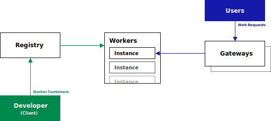

# vlcluster
[](https://badge.fury.io/js/vlcluster)

Simple docker and nginx-based cluster designed for multi-env web applications.

> vlcluster is currently beeing restructured



# Getting Started
vlcluster consists of four different node types
- `registry` Manages the cluster; stores and delivers applications
- `worker`s Run `instance`s of applications
- `gateway`s Create nginx-proxys to `instance`s running in `worker`s
- `client` Developers; can manage the cluster and push new applications

You can put multiple different node types on the same computer

## Setting up the cluster
We use ubuntu-server on all of our nodes

### Creating the registry
Run the following commands to create our first registry. We'll call it **mainnet**. You can only have one registry per cluster - but you can have multiple clusters and switch between them! Make sure that your registry has a static ip address or a DNS entry, we'll need it later on to reference the node!
<pre>
npm install -g vlcluster
vlcluster init registry -n "<b>mainnet</b>"
</pre>

This will create the registry in `~/.vlcluster`. The command will return a **key**. This key will be used later on to create the workers and clients
<pre>
created registry!

private key: <b>8cfh8jVXPd...</b>
Store this key safely!
</pre>

Open a new terminal and run `vlcluster daemon` to start the daemon. Keep this terminal open!

### Setting up our first worker
Now you can either switch to a new machine or install the worker and the registry on the same machine. Run the following commands to create a worker and assign it a `endpoint` address.
<pre>
# install packages
sudo apt install docker.io # install docker (if you don't already have it)
npm install -g vlcluster

# create worker
vlcluster init worker -n "worker1" -h <b>registry.example.com</b> -k <b>8cfh8jVXPd4...</b>

# set workers endpoint address
vlcluster init endpoint -c <b>mainnet</b> -h <b>worker1.example.com</b>
</pre>

Restart the `vlcluster daemon` process if your worker is on the same node as the registry. If you're using a different node, open a new terminal and run `vlcluster daemon` in it.

### Creating a gateway
We want our requests to be able to get to our `instance`s, so let's setup the gateway. You can do this on the same node as your `worker` or `registry`!
<pre>
# install packages
sudo apt install nginx
npm install -g vlcluster

# create gateway
vlcluster init gateway --name "gateway1" --cluster-hostname <b>registry.example.com</b> --cluster-key <b>8cfh8jVXPd4...</b> --endpoint-hostname <b>gateway1.example.com</b>
</pre>

If you're on a node that already has a `vlcluster daemon` running, restart the deamon. Start `vlcluster daemon` if this is a new node

### Connecting to the cluster
Let's get our first app published on our new **mainnet** cluster!

First, let's create a `client`. Open a new terminal on your computer and type
```
vlcluster init
```

Now enter your email, the hostname of our registry (`registry.example.com` in the example) and paste the key (`8cfh8jVXPd4...` in our example).

> You need to have docker installed on your system → [Installation page](https://docs.docker.com/get-docker/)

### Setting up applications
Clone [vlcluster example](https://github.com/levvij/vlcluster-example) and open a terminal in the project directory
> Every vlcluster application requires a simple `Dockerfile` and a `package.json` with `name` and `version`

We'll deploy the `vlcluster-example` application to our registry, with the `env` **productive**.

<pre>
vlcluster deploy -c mainnet -e <b>productive</b>
</pre>

We want to reach the application, right? Let's route your domain name (`example-application.example.com:80` in this example) to the `vlcluster-example` application - but only to instances running as **productive**.

<pre>
vlcluster route domain -c <b>mainnet</b> -h <b>example-application.example.com</b> -p <b>80</b> -a <b>vlcluster-example</b> -e <b>productive</b>
</pre>

`example-application.example.com` will automatically be routed to the latest version of `vlcluster-example` running as `productive`.  A simple deploy is all you need now! vlcluster will install the new version, await application start up, update the proxies and then stop the old instances - there is no gap between deploys!

Imagine you'd wanna run a <b>test</b> environnement, and have it available on `test.example-application.example.com`. All you'll have to do is just type in those commands:
<pre>
vlcluster deploy -c mainnet -e <b>test</b>
vlcluster route domain -c mainnet -h <b>test.example-application.example.com</b> -p 80 -a vlcluster-example -e <b>test</b>
</pre>

### Variables
Nobody wants hardcoded database connection strings! Thats why vlcluster allows you to create variables which will be set as ENV-variables in your applications

Just run:
<pre>
# set variable for instances of <u>all</u> applications in <u>all</u> environnements
vlcluster var set -c mainnet -n <b>DATABASE_HOST</b> -v <b>data.example.com</b> -a -e

# set variable for instances of <u>vlcluster-example</u> in <u>all</u> environnements
vlcluster var set -c mainnet -n <b>DATABASE_USER</b> -v <b>example</b> -a <b>vlcluster-example</b> -e

# set variable for instances of <u>vlcluster-example</u> in <u>test</u> and <u>productive</u> environnements
vlcluster var set -c mainnet -n <b>DATABASE_NAME</b> -v <b>example</b> -a <b>vlce_db_prod</b> -e <b>productive</b>
vlcluster var set -c mainnet -n <b>DATABASE_NAME</b> -v <b>example</b> -a <b>vlce_db_test</b> -e <b>test</b>
</pre>

The variables will be set after a `deploy` or a `vlcluster instance restart`

# Command Reference
## Setup
```
vlcluster init [client] [-e | --email <email>] [-h | --hostname <registry hostname>] [-k | --key <registry key>]
vlcluster init registry [-n | --name <registry name>]
vlcluster init worker [-h | --hostname <registry hostname>] [-k | --key <registry key>] [-n | --name <worker name>]
vlcluster init endpoint [-c | --cluster <registry hostname>] [-h | --hostname <endpoint hostname>]
vlcluster init gateway [--cluster-hostname <cluster hostname>] [--cluster-key <cluster key>] [-n | --name <gateway name>] [--endpoint-hostname <endpoint hostname>]
```

## Building and Publishing
```
vlcluster build [[ -p | --project-path ] <project path> = "."]
vlcluster push [-c | --cluster <registry hostname>] [[ -a | --application ] <application>] [[ -v | --version ] <version>]
vlcluster upgrade [-c | --cluster <registry hostname>] [[ -a | --application ] <application>] [[ -v | --version ] <version>] [[ -e | --env ] <environnement>]

vlcluster deploy [-c | --cluster <registry hostname>] [[ -e | --env ] <environnement>] [[ -p | --project-path ] <project path> = "."]
```

## Variables
```
vlcluster var set [-c | --cluster <registry hostname>] [[ -n | --name ] <name>] [[ -v | --value ] <value>] [-a | --application [ <application> ]] [-e | --env [ <environnement> ]]
vlcluster var list [-c | --cluster <registry hostname>] [-a | --application [ <application> ]] [-e | --env [ <environnement> ]]
```

## Instance Management
```
vlcluster instance list [-c | --cluster <registry hostname>] [-a | --application [ <application> ]] [-e | --env [ <environnement> ]]
vlcluster instance restart [-c | --cluster <registry hostname>] [-a | --application [ <application> ]] [-e | --env [ <environnement> ]]
```

## Routing
```
vlcluster route domain [-c | --cluster <registry hostname>] [-h | --host <host>] [-p | --port <port>] [-a | --application <application>] [-h | --host <host>] [-e | --env <env>]
vlcluster route websocket [-c | --cluster <registry hostname>] [-h | --host <host>] [-p | --port <port>] [-l | --location <location>]
```

## SSL 
SSL certificates are created by [certbot](https://certbot.eff.org/) which needs to be installed on the gateways!
```
vlcluster ssl enable [-c | --cluster <registry hostname>] [-h | --host <host>] [-p | --port <port>]
```